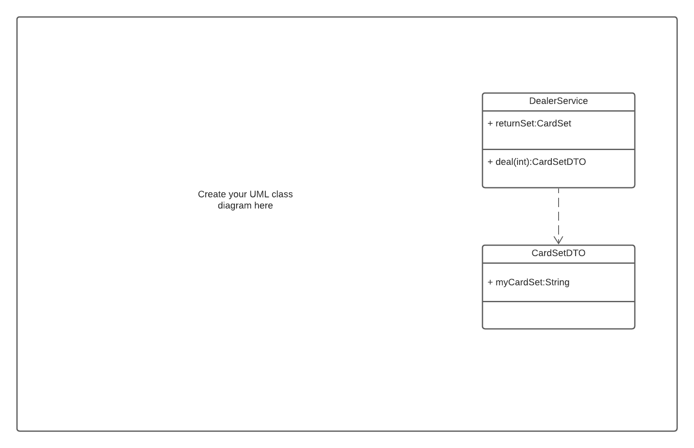

## Learning Outcomes
* You will be able to design classes that work together to solve a problem
* You will be able to separate models from logic in your code
* You will be able to write code that is organized, easily understood, and free of errors

## Topics Covered:
- Services
- DTOs
- Designing a solution

# Activity
In this activity, you'll be designing an online game system that uses a DealerService to shuffle the card deck and deals out the cards.

In this activity, you will create a UML diagram and the associated interface in order to meet the project requirements. You will not need to write the final program -- just show the design components.

To turn in:
* UML Class Diagram
* Interface and abstract class definitions with attributes method signatures

# Project Requirements
The online game system should be designed to handle multiple game options.

When a player enters the application, they will select a game to play. Whichever game the player selects will handle calling the `DealerService` to get a randomly dealt hand of cards and then check whether the player wins.

The __Player__ must be implemented with these attributes and operations:
1) `totalCash` for dollar amount the player possesses as double
2) `checkTotalCash()` method returns double: Check available dollar amount by taking in no arguments and returning dollar amount as double
3) `updateTotalCash(double total)` method returns void: Update available dollar amount by taking in dollar amount as a double.

A __CardHand__ must be implemented to hold the cards returned from `DealerService` with these attributes:
1) `numCards` for number of cards as int
2) `cardArray` as array of `Card` values

A __Card__ class must be implemented to track the value of one card with these attributes:
1) `value` as char value ('A','2','3','4','5','6','7','8','9','10','J','Q','K')
2) `suit` as String value (i.e. heart, diamond, club, spade)

Each __Game__ is required to be implemented with these attributes and operations:

1) `name` of the game as string
2) `numCardsPerHand` for the number of cards per hand as int
3) `betAmount` for amount of bet as double
4) `requestDeal(int number)` method returns a `CardSetDTO` object
5) `checkHand(CardHand hand)` method returns a boolean value

## Instructions
1) Create a UML class diagram:

Design an online game system and create a UML class diagram to represent the interfaces and abstract classes required. Use LucidChart to create a class diagram and export the diagram as a .png file. You can use the drawing below which provides the `DealerService` and `CardSetDTO` class diagrams as a starting place.

2) Write code:
   Create the abstract classes defined in the class diagram in the Game.java file. You will not need to code the business logic.

Check in your Game.java file and a UML Diagram created in LucidChart to your github repository.

## Testing

The `Main.java` and `Game.java` file should compile without error.
Run the testing methods inside `GameTest.java` to test that all of the unit tests pass.

All interfaces, classes, methods and properties displayed in the UML class diagram submitted should be implemented in the Java code. Compile and run the `GameTest.java` to confirm that you have defined abstract classes correctly.

# Reflection
*Each activity, we'll try to give you something a little extra to think about. Write a short response to this question:*

Why is there no information about attributes or other methods used by the `DealerService` class in the diagram?

# Submission
Submit the URL to your Github repository and your response to the reflection question.

### Grading
This activity will be graded according to the following completion criteria and learning outcomes:

### Completion Criteria
* UML Class diagram includes all components described in the **Project Requirements**.
* Interfaces are defined for all classes in UML Class diagram.
* Interfaces compile without error.
